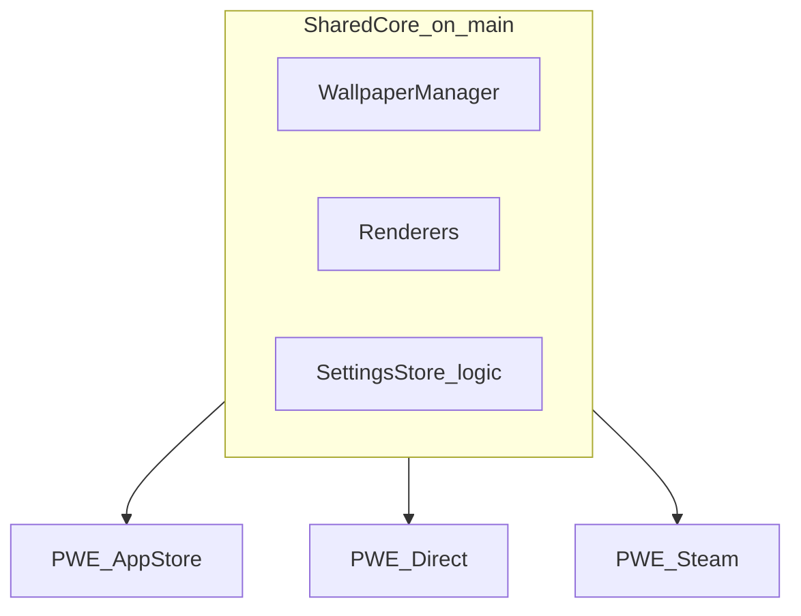

# Distribution Channels — Strategy and Comparison

**Status:** Phase 10 research complete (2026-06-21) · **Amended:** 2026-08-20 (App Store–first launch; trunk + flavors)  
**Related:** [`DISTRIBUTION.md`](DISTRIBUTION.md), [`APP_STORE_SUBMISSION.md`](APP_STORE_SUBMISSION.md), [`V2_2_APP_STORE_IMPLEMENTATION.md`](V2_2_APP_STORE_IMPLEMENTATION.md), [`V2_2_DIRECT_IMPLEMENTATION.md`](V2_2_DIRECT_IMPLEMENTATION.md), [`PHASE_10A_FEASIBILITY.md`](PHASE_10A_FEASIBILITY.md), [`PHASE_10B_SCREENSAVER_RESEARCH.md`](PHASE_10B_SCREENSAVER_RESEARCH.md), [`PHASE_10C_LOCK_SCREEN_RESEARCH.md`](PHASE_10C_LOCK_SCREEN_RESEARCH.md), [`PHASE_10_SUMMARY.md`](PHASE_10_SUMMARY.md)

---

## 0. Current channel priority (2026-08-20)

| Priority | Channel | When | Feature ceiling |
|----------|---------|------|-----------------|
| **1 — First ship** | Mac App Store | V2.2 M1 (compliance) → M2 (Tier A+B) | Desktop + Tier A+B; **no Tier C** |
| **2 — Second** | Direct DMG/zip | After App Store stable (M3) | Full including conditional Tier C + Sparkle |
| **3 — Optional** | Steam | Only if Steamworks committed | Same technical ceiling as Direct; unsandboxed |

**Git / build policy:** One trunk (`main`) + build flavors. **Do not** create permanent `app-store` / `direct` / `steam` branches. See [`V2_2_APP_STORE_IMPLEMENTATION.md`](V2_2_APP_STORE_IMPLEMENTATION.md) § Branching and KB ADR-008 amendment.

Phase 10 research scored Direct highest for free + tips and complete Tier A/B/C. That scoring informs **capability**; launch **order** is App Store first for discovery and trust.

---

## 1. Master feature × channel matrix

| Feature | Universal | App Store | Direct | Steam | Notes |
|---------|-----------|-----------|--------|-------|-------|
| Desktop video wallpaper | Shipped (Ph 1–9) | Enable (M1) | Enable | Enable | Core product |
| Multi-monitor + per-display | Shipped | Enable | Enable | Enable | |
| Collections + setups | Shipped | Enable | Enable | Enable | |
| Quick modes + menu bar | Shipped | Enable | Enable | Enable | `LSUIElement` — explain in review notes |
| Local library | Shipped | Enable | Enable | Enable | No account |
| Web wallpapers (WKWebView) | Shipped | Enable (+ network entitlement) | Enable | Enable | Add outbound network for MAS if remote URLs |
| Performance profiles / diagnostics | Shipped | Enable | Enable | Enable | |
| **Tier A — static lock export** | Conditional GO | **Enable (M2)** | Enable (M2) | Enable | App Store–safe |
| **Tier B — video screensaver** | GO | **Enable (M2)** | Enable (M2) | Enable | App Group + `.saver` |
| **Tier C — lock live video** | Conditional GO | **Disable** | Conditional (M3+) | Conditional | Private API; MAS rejection risk |
| Sparkle / external updates | N/A | Disable | Enable (M3) | Disable | MAS / Steam handle updates |
| Steam Workshop | Out of scope v1 | Disable | Optional later | Strategic fit | Phase 11+ |
| Free + optional tips | Preferred | Feasible (IAP) | **Recommended** | Feasible (caveats) | §7 |
| iCloud sync (future) | Planned | CloudKit | Custom / none | Steam Cloud | §8 |
| CPU history graphs (V2.1) | Planned | Enable | Enable | Enable | Not Phase 10 |

**Primary channel differentiation:** Tier C lock-screen live video + sandbox/Steamworks policy stack.

---

## Appendix A — Mac App Store

### Positioning

"Native Mac wallpaper engine — private, local, no account."

### Policies and review risks

| Topic | Requirement | PWE impact |
|-------|-------------|------------|
| App Sandbox | Mandatory | Current build already sandboxed |
| Private APIs | Prohibited | **Tier C blocked** |
| Screen saver extension | Allowed (public API) | Tier B OK with App Group |
| Menu bar agent (`LSUIElement`) | Allowed with justification | Document background behavior in review notes |
| External update mechanisms | Prohibited | Remove/disable `UpdateChecker.openReleasePage()` on MAS flavor |
| In-app purchases | Optional | Tip jar IAP possible (Apple 15–30% cut) |
| Privacy | Nutrition labels + Privacy manifest | Add `PrivacyInfo.xcprivacy` |

Source: [App Store Review Guidelines](https://developer.apple.com/app-store/review/guidelines/)

### Signing and updates

- Distribution: Apple notarization via App Store Connect
- Updates: App Store only
- Discovery: Search, categories (`public.app-category.graphics-design`), editorial

### Phase 10 features on App Store

| Tier | Status |
|------|--------|
| A — static lock export | Enable |
| B — screensaver | Enable (strongest Phase 10 story) |
| C — lock live video | **Disable** |

### Current vs delta

| Item | Current | App Store delta |
|------|---------|-----------------|
| Sandbox | Yes | Keep |
| App Group | No | **Add** for screensaver (M2) |
| Network entitlement | No | **Add** if web wallpapers load remote URLs (M1) |
| Privacy manifest | No | **Add** (M1) |
| `.saver` target | No | **Add** (M2) |
| UpdateChecker external URL | Placeholder | **Disable** on MAS build (M1) |
| Tip / support link | No | Optional IAP (M2+) or compliant external link |
| Tier C code | No | **Exclude** via compile flag |
| App Store assets | No | Screenshots, description, review notes (M1) |
| Build flavor | Single | **`PWE App Store`** scheme on same `main` (M1) |

Charter: [`V2_2_APP_STORE_IMPLEMENTATION.md`](V2_2_APP_STORE_IMPLEMENTATION.md) · Submission: [`APP_STORE_SUBMISSION.md`](APP_STORE_SUBMISSION.md)

### Future features (App Store)

- iCloud: CloudKit natural fit
- Workshop: Blocked without Apple-hosted UGC + moderation
- Interactive wallpapers: Unlikely to pass review complexity

---

## Appendix B — Direct web (DMG / zip / Homebrew)

### Positioning

"Wallspace-class features, you own your files — free."

### Policies

| Topic | Requirement |
|-------|-------------|
| Signing | Developer ID Application |
| Notarization + stapling | Required for Gatekeeper |
| Sandbox | Optional — **current build keeps sandbox** (recommended) |
| Private APIs | Allowed at maintainer risk |
| Updates | Sparkle 2 (replace `UpdateChecker` placeholder) or manual DMG |

How-to: [`DISTRIBUTION.md`](DISTRIBUTION.md)

### Phase 10 features on Direct

| Tier | Status |
|------|--------|
| A | Enable |
| B | Enable |
| C | **Conditional** — macOS 26+ private path at user opt-in |

Optional **unsandboxed build flavor** only if Tier C research demands it during V2.2—default remains sandboxed for trust.

### Current vs delta

| Item | Current | Direct delta |
|------|---------|--------------|
| Notarization pipeline | Documented | Automate in CI on release tags |
| Sparkle | Placeholder (`UpdateChecker`) | **Implement Sparkle 2** |
| DMG layout | Documented | Produce per release |
| EULA + privacy policy | No | **Host on website** |
| App Group | No | **Add** for screensaver |
| `.saver` target | No | **Add** |
| Tier C integration | No | **Add** (Direct flavor) |
| Tip link in About | No | **Add** (Ko-fi, GitHub Sponsors, etc.) |
| Homebrew cask | No | Optional after stable URL |

### Future features (Direct)

- External tip links — **best fit**
- Self-hosted Workshop — costly; not recommended for solo maintainer
- Playlists / scheduling — universal

---

## Appendix C — Steam

### Positioning

"Wallpaper Engine for Mac" — **market gap** (WE app 431960 is Windows-only; [official FAQ](https://help.wallpaperengine.io/en/functionality/linuxmacos.html) cites ~2% Mac Steam users vs port cost).

### Policies ([Steamworks macOS](https://partner.steamgames.com/doc/store/application/platforms))

| Topic | Requirement |
|-------|-------------|
| App Sandbox (`com.apple.security.app-sandbox`) | **Must NOT be set** |
| Architecture | 64-bit universal (arm64 + x86_64) |
| Notarization | Required |
| Hardened Runtime | Required |
| Extra entitlements | `disable-library-validation`, `allow-dyld-environment-variables` (Steam overlay) |
| Steam Direct fee | $100 per app |
| Revenue share | ~30% Valve (tips external only) |

### Phase 10 features on Steam

Same technical ceiling as Direct:

| Tier | Status |
|------|--------|
| A, B | Enable |
| C | Conditional |

### Current vs delta

| Item | Current | Steam delta |
|------|---------|-------------|
| Sandbox | Yes | **Remove** on Steam flavor |
| Steamworks SDK | No | **Integrate** (C++ bridge) |
| App ID + depots | No | **Create** in Steamworks |
| Build scripts | xcodebuild only | + SteamPipe upload |
| Tier C | No | Same as Direct |
| Workshop | No | **Future** — major scope |
| Store page | No | Trailer, caps, regional pricing |

### Future features (Steam)

- **Steam Workshop** — strongest fit for UGC vs App Store
- Steam Cloud — small JSON sync for setups
- Achievements / cards — low priority marketing

### Risks

- Audience expects WE-like Workshop — local-only free app may disappoint unless store page is clear
- Maintaining Steam + Direct + optional MAS = 2–3 build flavors
- WE team rejected Mac port due to **forever maintenance** — same risk applies

---

## 5. Current project baseline

Research from codebase (Phases 1–9, post–June 2026 audit):

| Area | Current state |
|------|---------------|
| **Renderer stack** | Video (`VideoRenderer`, AVPlayer), web (`WebRenderer`, WKWebView), image; `Renderer` protocol |
| **Orchestration** | `@MainActor` `WallpaperManager`, `DisplayController` per display |
| **Entitlements** | App Sandbox, user-selected read-only files, app-scoped bookmarks |
| **Persistence** | `SettingsStore` — UserDefaults, collections, setups, quick modes, library |
| **Menu bar** | `MenuBarController`, `LSUIElement`, `DockAgentPolicy` |
| **Power / visibility** | `PowerPolicyManager`, `DesktopVisibilityTracker`, performance profiles |
| **Local library** | `LocalLibraryManager`, thumbnails, drag-drop import |
| **Distribution infra** | [`DISTRIBUTION.md`](DISTRIBUTION.md) — Developer ID, notarize, DMG; `UpdateChecker` opens GitHub releases (placeholder for Sparkle) |
| **Tests / CI** | XCTest (8 tests), `chunk7_regression.sh`, smoke scripts |
| **Deployment target** | macOS 15.0+ |
| **Phase 10 features** | None shipped |

---

## 6. Per-channel delta summary

Side-by-side: **changes from current codebase** (implementation phase — not done in Phase 10).

| Delta | App Store | Direct | Steam |
|-------|-----------|--------|-------|
| Build flavor / scheme | `PWE App Store` | `PWE Direct` (current+) | `PWE Steam` |
| Sandbox | Keep | Keep (default) | **Remove** |
| App Group | Add | Add | Add |
| `.saver` target | Add | Add | Add |
| Tier A UI | Add | Add | Add |
| Tier C integration | **No** | Add (conditional) | Add (conditional) |
| Update mechanism | App Store | Sparkle | Steam depots |
| Payment UI | IAP tip optional | External tip link | External tip link |
| Steamworks SDK | No | No | **Yes** |
| Privacy manifest | **Yes** | Website policy | Steam store page |
| Review / store assets | **Yes** | EULA on site | Steam page + trailer |
| Compile flags | `APP_STORE_BUILD` | `DIRECT_BUILD` | `STEAM_BUILD` |

---

## 7. Payment and monetization

### Preferred model

**Free app + optional tips** — justified while product remains local-only without online/community features.

### Per-channel assessment

| Channel | Free listing | Tip mechanisms | Feasibility | Blockers / caveats |
|---------|--------------|----------------|-------------|-------------------|
| **Direct** | Yes | Ko-fi, GitHub Sponsors, Buy Me a Coffee in About/Settings | **Recommended** | None significant; no platform cut |
| **App Store** | Yes | IAP consumable "tip"; or external "support developer" link that does **not** unlock features | **Feasible with caveats** | [Guideline 3.1.1](https://developer.apple.com/app-store/review/guidelines/) — no external payment for digital goods; IAP has 15–30% Apple cut |
| **Steam** | Yes (F2P) | External links only; no native tip jar | **Feasible with caveats** | $100 Steam Direct fee; free utilities may rank below paid competitors ($4.99 WE); store perception |

### Is paid recommended?

| Scenario | Paid recommended? | Why |
|----------|---------------------|-----|
| Local-only personal app | **No** | User preference; Direct supports free indefinitely |
| App Store | **No** (default) | Free + optional IAP tip sufficient |
| Steam positioning vs WE | **Optional**, not required | Free valid; paid could signal "serious product" but conflicts with user preference — document only |
| Repeated App Store rejection of free utility | Contingency only | Unlikely for wallpaper app; could revisit |
| Future Steam Workshop economy | **Changes model** | Out of scope v1; UGC may need moderation budget |

### Tax / legal (light touch)

- Tips via Ko-fi/Patreon: generally creator income; user handles tax reporting in their jurisdiction
- Steam F2P: no per-sale income until optional paid DLC or Workshop revenue
- App Store IAP: Apple issues tax forms per developer program rules

### Default decision (amended 2026-08-20)

Ship **free** on chosen channel(s). **First public channel: Mac App Store** (M1 desktop → M2 Tier A/B). Add **optional tip IAP** on App Store and **tip link** on Direct in later milestones—no paid tier required for v1. Build as **flavors on `main`**, not permanent channel branches.

---

## 8. Future roadmap impact (Phase 11+)

| Future feature | App Store | Direct | Steam |
|----------------|-----------|--------|-------|
| **iCloud sync** (KB Phase 11) | CloudKit — natural fit | No default; custom sync costly | Steam Cloud for small state |
| **Playlists / scheduling** | Universal | Universal | Universal |
| **Community / Workshop library** | Blocked without hosted moderation | Self-hosted costly | **Steam Workshop** — best fit |
| **Interactive/scripted wallpapers** | Unlikely (review + scope) | Possible | WE audience expectation — high effort |
| **CPU history graphs** (V2.1) | Universal | Universal | Universal |
| **Sparkle / auto-update** | N/A (App Store) | Direct only | N/A (Steam) |

**Naming note:** KB "Phase 11" (iCloud) collides with "post–Phase 10 implementation." Use **V2.2** for lock-screen/screensaver code; keep KB Phase 11 for iCloud feature doc.

---

## 9. Channel scoring and recommendation

Scored 1–5 (higher = better for PWE goals: local-first, free, feature completeness, low maintenance).

| Criterion | App Store | Direct | Steam |
|-----------|-----------|--------|-------|
| Feature completeness (Tier A/B/C) | 3 (no Tier C) | **5** | **5** |
| Maintenance cost | 4 | **4** | 2 |
| Review / policy risk | 3 | **5** | 4 |
| Free + tips fit | 3 | **5** | 3 |
| Local-first alignment | **5** | **5** | 4 |
| Discovery / marketing | 4 | 2 | **4** (WE niche) |
| **Weighted total** | ~22 | **26** | ~23 |

### Recommendation

| Role | Channel | Rationale |
|------|---------|-----------|
| **First ship (amended 2026-08-20)** | **Mac App Store** | Discovery + trust; Tier A+B only; compliance then features (M1 → M2) |
| **Second ship** | **Direct DMG/zip** | Best fit for **free + tips**, full Tier A/B/C ceiling, Sparkle; inherits M2 from same trunk |
| **Optional later** | Steam | Only if committing to long-term maintenance + eventual Workshop; unsandboxed flavor required |

**Historical scoring (June 2026):** Direct scored highest (~26) for local-first free + full feature ceiling. That score remains valid for capability; **launch order** prioritizes App Store first.

**Not recommended:** Steam before Direct; permanent per-channel git branches (use flavors on `main`).

---

## 10. Multi-flavor build architecture

Implementation in V2.2 — **same git trunk**, not three long-lived branches.

| Scheme | Sandbox | Steamworks | Tier C | Updates |
|--------|---------|------------|--------|---------|
| PWE App Store (first) | Yes | No | **Disabled** | App Store |
| PWE Direct (second) | Yes | No | Conditional | Sparkle |
| PWE Steam (optional) | **No** | Yes | Conditional | Steam |

Minimize duplication:

- Shared Swift sources for engine core on `main`
- Per-flavor entitlements plists + `.xcconfig`
- `#if APP_STORE_BUILD`, `#if STEAM_BUILD`, `#if DIRECT_BUILD`
- Short-lived feature branches only; never permanent `app-store` / `direct` / `steam` forks

Charter: [`V2_2_APP_STORE_IMPLEMENTATION.md`](V2_2_APP_STORE_IMPLEMENTATION.md)

---

## References

- [`PHASE_10A_FEASIBILITY.md`](PHASE_10A_FEASIBILITY.md)
- [`PHASE_10B_SCREENSAVER_RESEARCH.md`](PHASE_10B_SCREENSAVER_RESEARCH.md)
- [`PHASE_10C_LOCK_SCREEN_RESEARCH.md`](PHASE_10C_LOCK_SCREEN_RESEARCH.md)
- [`PHASE_10_SUMMARY.md`](PHASE_10_SUMMARY.md)
- [`DISTRIBUTION.md`](DISTRIBUTION.md)
- [`APP_STORE_SUBMISSION.md`](APP_STORE_SUBMISSION.md)
- [`V2_2_APP_STORE_IMPLEMENTATION.md`](V2_2_APP_STORE_IMPLEMENTATION.md)
- [`V2_2_DIRECT_IMPLEMENTATION.md`](V2_2_DIRECT_IMPLEMENTATION.md)
