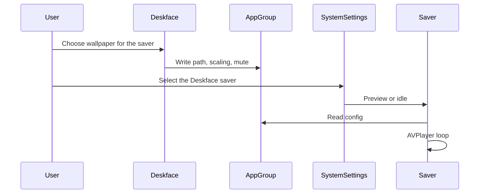

# Milestone 2 — Screensaver and static lock export

**Status:** Part 1 (screensaver) is implemented on `feature/tier-a-b` and still needs owner QA. Part 2 (static lock export) is not started. Do not tag `v1.1` until Part 2 ships, unless you intentionally release the saver alone.  
**Tag (planned):** `v1.1`  
**Branch:** `feature/tier-a-b` → `main` (delete the branch after merge)  
**Estimate:** about 15–20 days  
**Channels:** every flavor. Live lock-screen video stays out of this milestone.

Research this spec was taken from is in [archive/](archive/) (`PHASE_10B_SCREENSAVER_RESEARCH.md`, `PHASE_10C_LOCK_SCREEN_RESEARCH.md`).

---

## Goal

Give App Store and later Direct builds the two lock-adjacent features that can ship on every channel:

- **Screensaver.** A `.saver` bundle that loops the user’s video on idle.
- **Static lock export.** Save one frame and walk the user through System Settings. macOS has no public API that sets the lock-screen image for a sandboxed app.

Store copy must not claim live video on the lock screen.

---

## Screensaver

The saver runs in the system screen-saver host. It does not load `WallpaperManager` and it does not inherit the main app’s sandbox. The main app writes the chosen video into an App Group; the saver reads it.

**App Group ID:** `group.Personal.Personal-Wallpaper-Engine` (team `W2A9J24774`). The same string is in the app entitlements and `DeskfaceSaver.entitlements`. Register that group in the Apple Developer account and enable it on App ID `Personal.Personal-Wallpaper-Engine` and on `Personal.Personal-Wallpaper-Engine.DeskfaceSaver` before a signed archive.

The saver cannot use the main app’s app-scoped bookmarks. Part 1 copies the chosen video into the App Group container (`Screensaver/<original filename>`) and stores that relative path in `saver.videoPath`. A repeat apply with the same source identity refreshes settings and does not copy again. A failed copy leaves the previous file in place.

| Key | Type | Purpose |
|-----|------|---------|
| `saver.videoPath` | String | Path, or store bookmark `Data` instead so the saver can open a sandboxed file |
| `saver.scalingMode` | String | Same scaling names as the desktop player |
| `saver.syncWithDesktop` | Bool | Mirror the desktop wallpaper |
| `saver.lastUpdated` | Date | Stale detection |

Without the App Group, the user would have to pick the video again inside Screen Saver settings.

Install from the app: copy or register the `.saver` (inside the app bundle on the App Store; `~/Library/Screen Savers/` is the Direct pattern). Settings gets a toggle, a “use the desktop wallpaper” option, and a button that opens System Settings → Screen Saver. Mute by default. A missing file shows a still placeholder. Preview (`isPreview`) should cost less CPU than full-screen idle. One `ScreenSaverView` per display; handle preview and full-screen separately.

Start with one playback quality. Sharing decode settings with `SharedVideoPlaybackSession` can wait. Duplicate a minimal AVPlayer loop in the saver target rather than loading the desktop engine into that process.

---

## Static lock export

1. User chooses **Export lock screen image**.
2. The app writes a PNG or JPEG of the current frame to `~/Pictures/Personal Wallpaper Engine/` or a folder the user picks (security-scoped bookmark).
3. A sheet tells them to open System Settings → Wallpaper and add that image to the Lock Screen.
4. Remember the last export path.

This works on macOS 15 and later. It is review-safe on the App Store. Do not call a private API to apply the image.

Multi-display: export must work for one display and for several. Each display can need its own still.

---

## Project touch list

| Item | Action |
|------|--------|
| App Group entitlement | Main app and `.saver`. `REGISTER_APP_GROUPS` is currently off in the Direct xcconfig; turn the group on for real in both plists |
| `.saver` target | `ScreenSaverView` plus an AVPlayer loop; read App Group config |
| Lock export UI | Frame capture → Pictures (or a chosen folder) → guided System Settings |
| Settings section | “Lock Screen & Screen Saver”. No live-lock copy in the App Store build |
| Optional tip IAP | App Store build only (`#if APP_STORE_BUILD`) |
| Regression | Extend [RELEASE_CHECKLIST.md](RELEASE_CHECKLIST.md) when the features exist; the Milestone 2 rows are already listed there |

---

## Acceptance

- [ ] `feature/tier-a-b` merged to `main` and the branch deleted
- [ ] Lock export works on a single display and on multiple displays
- [ ] Saver preview and idle playback read App Group state after the app relaunches
- [ ] The App Store binary still excludes live lock-screen video and external update URLs
- [ ] App Store update screenshots and What’s New for 1.1
- [ ] Owner sign-off on the Milestone 2 row in [RELEASE_RECORD.md](RELEASE_RECORD.md)

---

## Rough split

| Task | Days |
|------|------|
| `.saver` target and AVPlayer loop | 3–5 |
| App Group and settings sync | 2–3 |
| Settings UI and install helper | 2 |
| Lock export and System Settings guide | included in the 15–20 day total |
| Packaging per channel | 1–2 |
| Manual QA (preview, idle, multiple monitors) | 2–3 |
