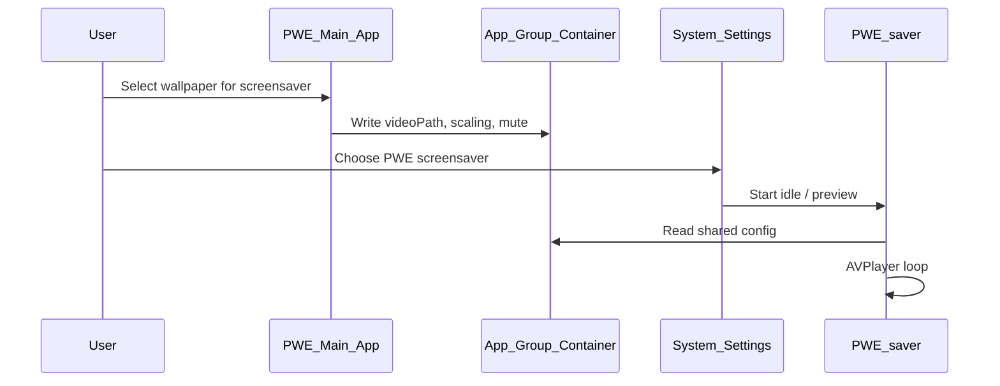

# Phase 10B — Screensaver Research

**Status:** Complete (2026-06-21)  
**Scope:** Mandatory research — runs regardless of Tier B GO/NO-GO  
**Tier B rating:** **GO** (see [`PHASE_10A_FEASIBILITY.md`](PHASE_10A_FEASIBILITY.md))  
**Related:** [`PHASE_10C_LOCK_SCREEN_RESEARCH.md`](PHASE_10C_LOCK_SCREEN_RESEARCH.md), [`DISTRIBUTION_CHANNELS.md`](DISTRIBUTION_CHANNELS.md)

---

## 1. Executive summary

Video screensaver via a public `.saver` bundle is **technically feasible on all three distribution channels**. It is the most **App Store–friendly** Phase 10 feature and should ship on every channel where Phase 10 features are implemented.

Screensaver does **not** replace lock-screen live video—it activates on idle timeout, not at login lock. It is a strong **fallback story** for App Store users who cannot get Tier C.

---

## 2. Feasibility

### Public API viability

| API / component | Role | Supported |
|-----------------|------|-----------|
| `ScreenSaverView` | Subclass for custom drawing / AVPlayer layer | Yes |
| `.saver` bundle | Installed to `~/Library/Screen Savers/` or embedded in app | Yes |
| `legacyScreenSaver.appex` | Host process for screen savers | Yes (system) |
| AVFoundation / AVPlayer | Loop local MP4/MOV | Yes |
| App Group container | Share video paths + settings with main app | Yes (entitlement) |

### Sandbox constraints

The screen saver **does not inherit** the main app's sandbox. It runs under the screen saver host with its own entitlements embedded in the `.saver` bundle. Typical pattern:

1. Main app (sandboxed) writes video path + preferences to App Group `UserDefaults` or JSON file.
2. `.saver` extension reads App Group container (requires matching App Group ID in both targets).
3. `.saver` uses security-scoped bookmarks **or** copies/media stored inside App Group container.

**Blocker if skipped:** Without App Group, user must re-pick videos inside screen saver preferences (poor UX).

### macOS version support

- **Minimum:** macOS 15 (matches PWE deployment target)
- **Multi-monitor:** `ScreenSaverView` receives one view; system may instantiate per display—research implementation should handle `isPreview` vs full-screen.

---

## 3. How it would work

### Bundle structure

```text
PersonalWallpaperEngine.saver/
├── Contents/
│   ├── Info.plist
│   ├── MacOS/
│   │   └── PersonalWallpaperEngine (executable)
│   └── Resources/
│       └── (optional assets)
```

### Lifecycle



1. **Install:** Main app copies or registers `.saver` to `~/Library/Screen Savers/` (Direct/Steam) or ships inside app bundle (App Store).
2. **Configure:** User picks saver in System Settings → Screen Saver; optional in-app "Open Screen Saver Settings" button.
3. **Sync:** When user applies desktop wallpaper, optional toggle "Use same video for screen saver" writes to App Group.
4. **Run:** On idle, system loads `.saver`; AVPlayer loops with same scaling modes as desktop where possible.
5. **Uninstall:** Remove `.saver` bundle + clear App Group keys.

### Video playback

- Reuse **decode settings** from `SharedVideoPlaybackSession` / performance profiles where practical (may simplify in v1 screensaver: single quality profile).
- Mute by default (matches desktop default).
- Handle missing file: show static placeholder + "Open Personal Wallpaper Engine" button in configure sheet if `ScreenSaverView` supports configure UI.

---

## 4. Architecture sketch

### App Group schema (proposed)

**App Group ID:** `group.com.local.wallpaper.engine` (placeholder — must match team ID at implementation)

| Key | Type | Purpose |
|-----|------|---------|
| `saver.videoPath` | String | Absolute path or bookmark data |
| `saver.scalingMode` | String | `resizeAspectFill`, etc. |
| `saver.syncWithDesktop` | Bool | Mirror desktop wallpaper |
| `saver.lastUpdated` | Date | Stale detection |

Optional: store bookmark `Data` instead of path for sandbox-safe access from `.saver`.

### Module reuse from current codebase

| Module | Reuse strategy |
|--------|----------------|
| `VideoRenderer` / AVPlayer setup | Extract shared **playback helper** (future refactor) or duplicate minimal loop in `.saver` target |
| `SettingsStore` | Add App Group suite; dual-write desktop + saver keys |
| `WallpaperManager` | **Not** loaded in `.saver` process |
| `Performance profiles` | Optional v2; start with single profile in screensaver |
| Scaling enums | Share via small shared Swift package or duplicated constants |

### New targets (V2.2 — not built in Phase 10)

- `PersonalWallpaperEngineSaver.saver` — ScreenSaverView target
- Shared framework (optional): `PWEPlaybackCore`

### New entitlements (main app)

```xml
<key>com.apple.security.application-groups</key>
<array>
    <string>group.com.local.wallpaper.engine</string>
</array>
```

Same App Group in `.saver` embedded entitlements.

---

## 5. User lifecycle

| Step | User action | System behavior |
|------|-------------|-----------------|
| Enable | Toggle "Screen saver" in PWE Settings | Register `.saver`, write App Group |
| Match desktop | Toggle "Sync with desktop wallpaper" | On apply, update App Group |
| Select saver | System Settings → Screen Saver | User picks PWE saver |
| Preview | System Settings preview | `.saver` `isPreview == true` — lower CPU |
| Idle | Machine idle timeout | Full-screen loop on assigned displays |
| Disable | Turn off toggle in PWE | Stop updating App Group; user may switch saver in System Settings |

---

## 6. Per-channel analysis

| Aspect | App Store | Direct DMG | Steam |
|--------|-----------|------------|-------|
| **Feasibility** | GO | GO | GO |
| **Install path** | `.saver` inside app bundle; helper installs on first launch | Copy to `~/Library/Screen Savers/` | Bundled in depot; post-install script |
| **App Group** | Required | Required | Required |
| **Review risk** | Low if public APIs only | N/A | N/A |
| **Updates** | App Store updates both app + saver | Sparkle / manual | Steam depot |
| **Differentiation** | **Strong story** — only Phase 10 feature likely fully enabled vs Tier C | Full feature set | Same as Direct |

**Policy citations:**

- App Store: Screen savers are standard macOS extensions; no Guideline conflict for local video loop.
- Direct: No review; notarization covers `.saver` binary inside signed bundle.
- Steam: [Steamworks macOS doc](https://partner.steamgames.com/doc/store/application/platforms) — screensaver binary must be notarized as part of app bundle.

---

## 7. Current project delta

| Area | Current (Phases 1–9) | Required for Tier B |
|------|----------------------|---------------------|
| Xcode targets | Single app target | + `.saver` target (+ optional shared framework) |
| Entitlements | Sandbox, bookmarks | + App Group |
| Settings UI | No screensaver section | Toggle, sync option, open System Settings |
| `SettingsStore` | UserDefaults standard | App Group suite + keys |
| Distribution | Direct doc only | Per-channel install helper |
| Tests | Desktop smoke | Saver preview smoke (manual) |

**No code changes in Phase 10.**

---

## 8. Implementation estimate (V2.2)

| Task | Estimate |
|------|----------|
| `.saver` target + AVPlayer loop | 3–5 days |
| App Group + SettingsStore sync | 2–3 days |
| Settings UI + install helper | 2 days |
| Per-channel packaging | 1–2 days |
| Manual QA (multi-monitor, preview, idle) | 2–3 days |
| **Total** | **~10–15 days** |

---

## 9. Channel differentiation

| Channel | Screensaver role |
|---------|------------------|
| **App Store** | **Primary Phase 10 win** — ship Tier B + Tier A; market "dynamic screen saver + desktop" |
| **Direct** | Expected parity with competitors; table stakes |
| **Steam** | Bundle in depot; minor marketing vs WE (WE has no Mac screensaver story) |

If Tier B were NO-GO (it is not), App Store would lose its best Phase 10 feature—research would still document that gap.

---

## 10. References

- [`PHASE_10A_FEASIBILITY.md`](PHASE_10A_FEASIBILITY.md) § Tier B
- Apple `ScreenSaverView` documentation
- Aerial / pond companion-app patterns (open-source architecture notes)
- [`DISTRIBUTION_CHANNELS.md`](DISTRIBUTION_CHANNELS.md) § Feature matrix
