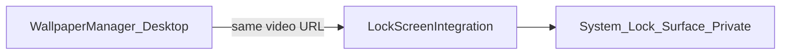

# Phase 10C — Lock-Screen Research

**Status:** Complete (2026-06-21)  
**Scope:** Mandatory research for Tier A (static), Tier C (live video), and channel enablement  
**Related:** [`PHASE_10A_FEASIBILITY.md`](PHASE_10A_FEASIBILITY.md), [`PHASE_10B_SCREENSAVER_RESEARCH.md`](PHASE_10B_SCREENSAVER_RESEARCH.md), [`DISTRIBUTION_CHANNELS.md`](DISTRIBUTION_CHANNELS.md)

---

## 1. Executive summary

Lock-screen integration is the **primary differentiator** between distribution channels:

- **App Store:** Tier A (static) only — Tier C blocked by review and lack of public API
- **Direct / Steam:** Tier A + conditional Tier C — private API paths at maintainer's risk

Screensaver (Tier B) is **not** lock screen—documented separately in 10B—but complements the product story on all channels.

---

## 2. Tier A — Static lock-screen frame

### Feasibility

**Rating: Conditional GO (all channels)**

| Approach | Description | Feasibility |
|----------|-------------|-------------|
| Export PNG/JPEG | Capture current video frame or pick still; save to user-accessible location | High |
| Open System Settings | `NSWorkspace` URL to `x-apple.systempreferences:com.apple.Wallpaper-Settings.extension` (macOS 15+) | High |
| Automated apply to lock | Undocumented / private on many OS versions | Low on App Store |

### How it would work

1. User clicks **"Export lock screen image"** in Settings or Home.
2. App writes image to `~/Pictures/Personal Wallpaper Engine/` or user-chosen folder (security-scoped bookmark).
3. In-app sheet: "Open System Settings → Wallpaper → add this image to Lock Screen."
4. Optional: remember last exported path in `SettingsStore`.

### macOS version gating

| Version | Tier A |
|---------|--------|
| macOS 15+ | Export + guided manual apply |
| macOS 26+ | Re-evaluate if public lock-screen setter APIs ship |

### Per-channel

| Channel | Tier A |
|---------|--------|
| App Store | **Enable** — fully review-safe |
| Direct | Enable |
| Steam | Enable |

---

## 3. Tier C — Lock-screen live video

### Feasibility

**Rating: Conditional GO — Direct and Steam only; NO-GO for App Store**

| Path | Description | App Store | Direct/Steam |
|------|-------------|-----------|--------------|
| Public API | None available | N/A | N/A |
| WallpaperExtensionKit (private) | Extension-style hook used by some competitors | Reject | Risk accepted |
| idleassetsd / aerials injection | System manifest manipulation | Reject | High break risk |
| Reverse-engineered WallpaperAgent | Binary hooking / swizzling | Reject | High break risk |

### Competitor observation (technique taxonomy)

| Competitor | Lock live video | Observed OS | Notes |
|------------|-----------------|-------------|-------|
| Wallspace Pro | Yes | macOS 26+ | Paid tier; private integration |
| Backdrop | Yes | Recent macOS | Similar positioning to Wallspace |
| Phosphene | Yes | arm64 focus | Smaller user base |
| Vivid Walls (App Store) | Unknown / limited | App Store | Likely avoids Tier C |

**Research constraint:** Phase 10 does not implement or document step-by-step private API recipes—only feasibility class and risk.

### macOS version gating

| Version | Tier C expectation |
|---------|-------------------|
| macOS 15 | Not viable for PWE v1 implementation |
| macOS 26+ | Conditional — follow competitor capability; expect breakage on point releases |

### arm64 / Intel

Private paths may target arm64 exclusively. Universal binary may require:

- Tier C disabled on Intel at runtime, or
- Separate arm64-only build note in store listing

Document in V2.2 implementation plan.

---

## 4. Proposed `LockScreenIntegration` (design sketch)

Markdown pseudocode only — **not implemented in Phase 10**.

```text
protocol LockScreenIntegration {
    var isAvailable: Bool { get }
    var activeTier: LockScreenTier { get }  // .none | .staticExport | .liveVideo

    func exportStaticLockFrame(from source: WallpaperSource) async throws -> URL
    func openSystemWallpaperSettings() 
    func enableLiveVideo(matchingDesktop: Bool) async throws  // Direct/Steam + OS gate
    func disableLiveVideo() async throws
    func handleOSVersionChange()  // disable Tier C if unsupported
}

enum LockScreenTier {
    case none
    case staticExport      // Tier A
    case liveVideo         // Tier C
}
```

### Feature flags per channel (compile-time)

```text
#if APP_STORE_BUILD
  - lockScreenTierC = false
  - lockScreenTierA = true
#endif

#if DIRECT_BUILD || STEAM_BUILD
  - lockScreenTierC = runtimeGate(macOS26+ && userOptIn)
  - lockScreenTierA = true
#endif
```

### Data flow (Tier C — conceptual)



- Desktop engine remains **source of truth** for video path.
- Lock adapter **must not** destabilize desktop playback on failure.
- On lock: optionally pause desktop decode (already partially handled via sleep/lock observers in `WallpaperManager`).

---

## 5. Version gating and failure modes

| Condition | Behavior |
|-----------|----------|
| Tier C unsupported OS | Hide live lock UI; show Tier A only |
| Tier C runtime failure | Disable Tier C; toast "Lock screen video unavailable on this macOS version" |
| Missing file / bookmark stale | Tier A export fails with user-facing error |
| App Store build | Tier C UI never shown |
| User disables lock features | `LockScreenTier.none`; desktop unchanged |

**Principle:** Desktop engine stability > lock-screen feature completeness.

---

## 6. Per-channel analysis

| Feature | App Store | Direct | Steam |
|---------|-----------|--------|-------|
| Tier A static export | **Enable** | Enable | Enable |
| Tier C live video | **Disable** (policy + API) | Conditional GO | Conditional GO |
| In-app "Pro lock" upsell | N/A (free app) | Optional tip link only | Same |

**Policy citations:**

- [App Store Review Guidelines 2.5.1](https://developer.apple.com/app-store/review/guidelines/) — private APIs
- [Guideline 2.5.2](https://developer.apple.com/app-store/review/guidelines/) — software must not download or install unrelated code in ways that circumvent review (relevant if Tier C uses dynamic hooks)

**Channel differentiation summary:**

| Channel | Lock-screen story |
|---------|-------------------|
| App Store | "Export a lock screen still from your wallpaper" + screensaver |
| Direct | "Wallspace-class live lock screen on supported macOS" (Tier C) |
| Steam | Same as Direct; marketing as WE-alternative for Mac |

---

## 7. Current project delta

| Area | Current | Tier A | Tier C |
|------|---------|--------|--------|
| Settings UI | No lock section | Export button, guidance sheet | Toggle + OS version notice |
| `SettingsStore` | No lock keys | `lockScreen.lastExportURL` | `lockScreen.liveEnabled` |
| Entitlements | Sandboxed | No change | May require **unsandboxed** build flavor |
| `WallpaperManager` | Lock observers exist | No change | Adapter calls on lock/unlock |
| Build flavors | Single | Same | Direct + Steam unsandboxed variant |
| Privacy manifest | N/A | Optional file access reason | Tier C may trigger additional scrutiny |

---

## 8. Implementation estimate (V2.2)

| Tier | Estimate |
|------|----------|
| Tier A — export + UX | 3–5 days |
| Tier C — research spike + private integration | 15–25 days (high uncertainty) |
| Feature flags + channel flavors | 3–5 days |
| QA per OS version | 5+ days ongoing |

**Tier C dominates maintenance cost** — aligns with Wallpaper Engine team's reason for not porting to Mac.

---

## 9. macOS 26 observations

See [`PHASE_10A_FEASIBILITY.md`](PHASE_10A_FEASIBILITY.md) § 10A.4.

No local macOS 26 hardware at research time. Tier C implementation must begin with **read-only** entitlement and behavior analysis on GA release before committing to a specific private path.

---

## 10. References

- [`PHASE_10A_FEASIBILITY.md`](PHASE_10A_FEASIBILITY.md)
- [`PHASE_10B_SCREENSAVER_RESEARCH.md`](PHASE_10B_SCREENSAVER_RESEARCH.md)
- [`DISTRIBUTION_CHANNELS.md`](DISTRIBUTION_CHANNELS.md)
- `WallpaperManager.swift` — lock/sleep observers
